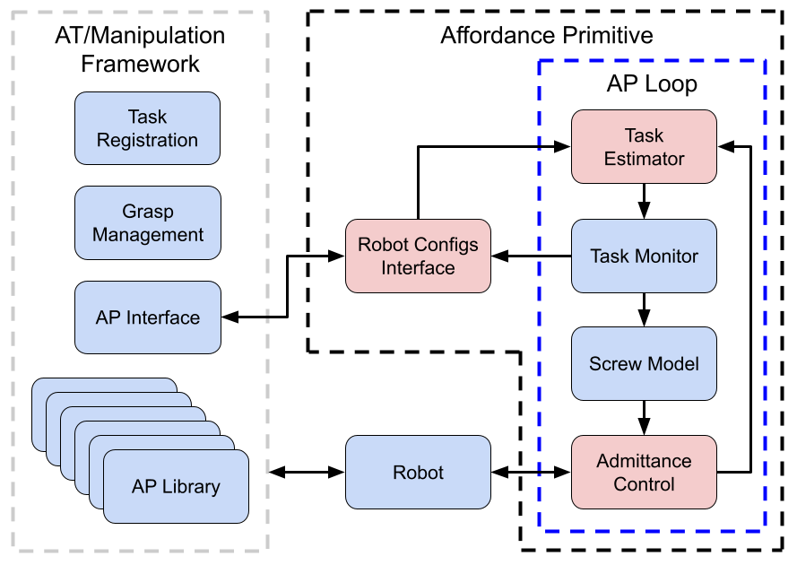

# Affordance Primitives

Affordance Primitives (APs) use screw theory to model contact-task affordances. So far, our work has concentrated on articulated objects (e.g, doors, valves, drawers, bolts), and an AP can represent almost task with these types of motions. An AP also considers the forces or torques that the manipulator must apply to perform the desired manipulation.

See [this video](https://www.youtube.com/watch?v=3TGl3F_4W_8) for an overview.

To see the docs locally: `roscd affordance_primitives ; firefox doc/html/namespaceaffordance__primitives.html`

# AP Framework
This repository includes a library for performing AP moves with a generic manipulator. See the paper (TODO: link when public) for more details. The major components of the framework are given below. Red nodes are plugins that allow customization

